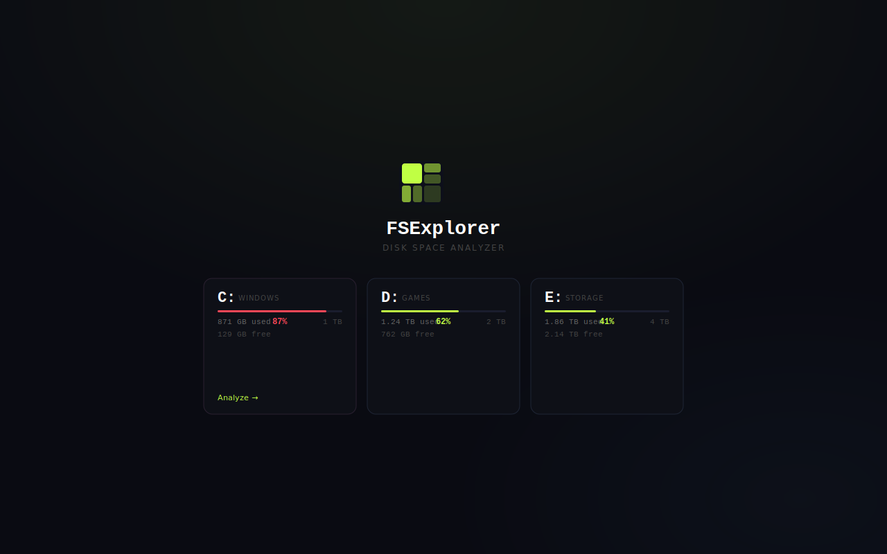
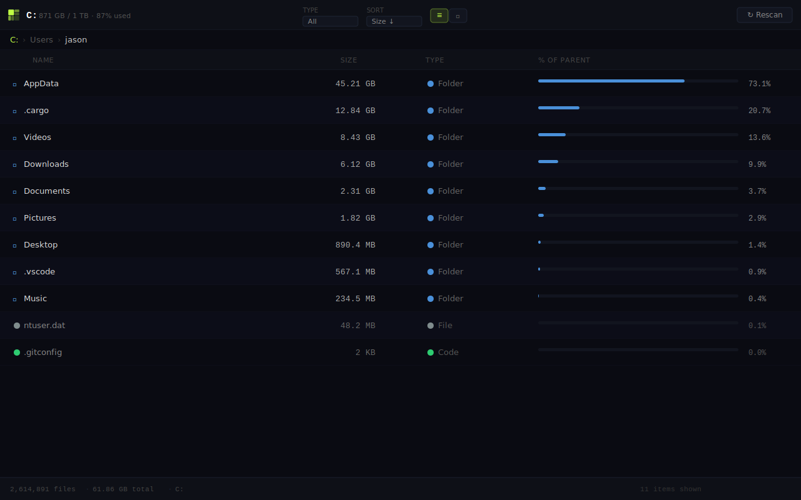
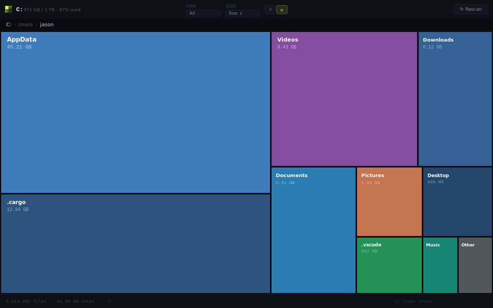

<div align="center">
  
</div>

<br/>

<div align="center">

[](https://github.com/DevoidSloth/FSExplorer/actions/workflows/build.yml)
[](https://github.com/DevoidSloth/FSExplorer/releases)
[](https://github.com/DevoidSloth/FSExplorer/releases)
[](https://github.com/DevoidSloth/FSExplorer/releases)
[](LICENSE)
[](https://tauri.app)

</div>

<br/>

**FSExplorer** is a fast, lightweight disk space analyzer for Windows and macOS. Scan drives with millions of files in seconds using parallel traversal, then navigate your storage visually with an interactive treemap or a sortable list view.

<br/>

## Screenshots



<br/>



<br/>



<br/>

## Features

| | |
|---|---|
| **⚡ Parallel scan** | Uses [jwalk](https://github.com/Byron/jwalk)'s work-stealing traversal to scan millions of files without thread-pool deadlocks |
| **🗺 Treemap view** | Squarified D3 treemap that reflows on resize — largest items immediately visible |
| **📋 List view** | Sortable table with inline size bars, type badges, and % of parent column |
| **🔍 Filter & sort** | Filter by type (image, video, audio, archive, document, code, executable); sort by size, name, or type |
| **📂 Drill-down** | Click any folder to navigate in; breadcrumb trail to jump back up |
| **🖱 Context menu** | Right-click → open in Explorer/Finder, copy path, or permanently delete |
| **💾 Lazy IPC** | Full tree lives in Rust memory; only the current folder's children cross the IPC boundary — instant navigation even on 500 GB scans |
| **🪟 + 🍎** | Native drive enumeration on Windows (`GetLogicalDrives`) and macOS (`statvfs` + `/Volumes`) |

<br/>

## Installation

Download the latest installer from the **[Releases page](https://github.com/DevoidSloth/FSExplorer/releases)**:

| Platform | Installer |
|---|---|
| Windows | `FSExplorer_x.x.x_x64-setup.exe` (NSIS) |
| Windows | `FSExplorer_x.x.x_x64_en-US.msi` |
| macOS | `FSExplorer_x.x.x_x64.dmg` |

> **macOS note:** CI builds are unsigned. If macOS blocks the app with a "damaged" warning, run:
> ```bash
> xattr -cr /Applications/FSExplorer.app
> ```
> For fully notarized builds, see [code signing setup](#code-signing-macos).

<br/>

## Development

**Prerequisites:**
- [Rust](https://rustup.rs) (stable)
- [Node.js 20+](https://nodejs.org)
- Platform prerequisites from [tauri.app/start/prerequisites](https://tauri.app/start/prerequisites/)

```bash
git clone https://github.com/DevoidSloth/FSExplorer.git
cd FSExplorer
npm install
npm run tauri dev
```

### Build for release

```bash
npm run tauri build
# Installers written to: src-tauri/target/release/bundle/
```

### Regenerate app icons

Edit `icon-source.svg`, then:

```bash
npm install --save-dev @resvg/resvg-js
node -e "
import('@resvg/resvg-js').then(({Resvg})=>{
  const fs=require('fs');
  const png=new Resvg(fs.readFileSync('icon-source.svg','utf8'),{fitTo:{mode:'width',value:1024}}).render().asPng();
  fs.writeFileSync('icon-source.png',png);
});"
npx tauri icon icon-source.png
npm uninstall --save-dev @resvg/resvg-js
```

### Code signing (macOS)

Add these secrets to **Settings → Secrets → Actions**:

| Secret | Description |
|---|---|
| `APPLE_CERTIFICATE` | Base64-encoded `.p12` Developer ID cert (`base64 -i cert.p12 \| pbcopy`) |
| `APPLE_CERTIFICATE_PASSWORD` | Password for the `.p12` |
| `APPLE_SIGNING_IDENTITY` | e.g. `Developer ID Application: Your Name (TEAMID)` |
| `APPLE_ID` | Your Apple ID email |
| `APPLE_PASSWORD` | App-specific password from [appleid.apple.com](https://appleid.apple.com) |
| `APPLE_TEAM_ID` | Your 10-character team ID |

The CI workflows sign and notarize automatically once these are set.

<br/>

## How it works

```
Pick a drive → Rust scans in parallel (jwalk) → Tree built in-memory
     ↓
Navigate → get_children IPC call → React renders list or treemap
     ↓
Right-click → open in Explorer/Finder · copy path · delete
```

**Two-phase scan:**
1. **Phase 1** — `jwalk` traverses the filesystem with a work-stealing thread pool, collecting a flat `Vec<RawEntry>` in parallel. Avoids the Rayon deadlock caused by recursive `par_iter()`.
2. **Phase 2** — Entries sorted deepest-first, then wired into a `HashMap<PathBuf, DirNode>` bottom-up. Sizes bubble up as children are attached to parents.

The full tree is held in a `Mutex<TreeState>` server-side. Navigation calls `get_children`, which does a single tree lookup and returns only immediate children as lightweight `DirEntry` structs — keeping IPC payloads small regardless of scan size.

<br/>

## Tech stack

| Layer | Technology |
|---|---|
| App shell | [Tauri 2](https://tauri.app) — Rust backend, WebView2 (Windows) / WKWebView (macOS) |
| Scan engine | [jwalk 0.8](https://github.com/Byron/jwalk) — parallel work-stealing FS traversal |
| Parallel sort | [Rayon](https://github.com/rayon-rs/rayon) — parallel unstable sort of flat entry list |
| Treemap layout | [d3-hierarchy](https://github.com/d3/d3-hierarchy) — squarified treemap (ratio 1.4) |
| UI framework | React 19 + TypeScript |
| Build tool | Vite 7 |
| Windows APIs | `GetLogicalDrives`, `GetDriveTypeW`, `GetDiskFreeSpaceExW`, `GetVolumeInformationW` |
| macOS APIs | `libc::statvfs`, `/Volumes` enumeration |

<br/>

## License

[MIT](LICENSE) © DevoidSloth
